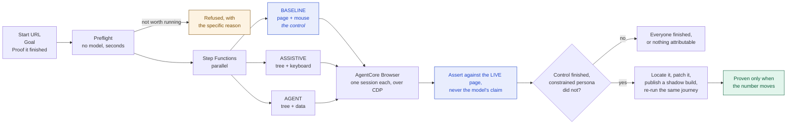

# Buyable

**Every accessibility tool tells you how many rules your site breaks. None of them tell
you whether anyone can actually buy.**

Buyable takes a real revenue journey, a checkout, a booking, an application, and
attempts it three times over: as someone using a screen reader, as an AI shopping
agent, and as a sighted customer with a mouse. It reports whether each one could
finish. When a journey cannot be completed it finds the element responsible, writes the
patch, and re-runs the journey against a build containing that patch to prove the fix
works.

Built for the AWS Zero to Shipped 2026 hackathon on Amazon Bedrock AgentCore Browser.

| | |
| --- | --- |
| Try it | https://d3luufd5s1g5pn.cloudfront.net |
| **How it works, end to end** | **[docs/architecture.md](docs/architecture.md)** |
| Add it to your pipeline | [docs/ci.md](docs/ci.md) |
| Is it ready for real users | [docs/production-readiness.md](docs/production-readiness.md) |
| Who can read a report | [docs/report-access.md](docs/report-access.md) |
| Accounts and journey history | [docs/accounts.md](docs/accounts.md) |
| Why the model is part of the instrument | [docs/model-study.md](docs/model-study.md) |
| How it did against the world's largest retailers | [docs/top-ten-retailers.md](docs/top-ten-retailers.md) |

## Why this is two problems, not one

An AI shopping agent reads the same accessibility tree a screen reader does. When that
tree is degraded, both constituencies degrade together, and the same missing attribute
closes two revenue channels at once.

- 55 percent of online shoppers with disabilities have abandoned a purchase because of
  accessibility barriers. In the UK alone that is 4.3 million shoppers and around 17
  billion pounds of spend walking away.
- A CHI 2026 study from UC Berkeley and the University of Michigan measured agent task
  success falling from 78 percent to 42 percent on sites with a degraded accessibility
  tree.
- The European Accessibility Act has been enforceable across all 27 member states since
  June 2025.

## What makes a Buyable result mean something

**A persona is a constraint, not a prompt.** Each one is a hard limit on what can be
perceived and done, enforced in the tool layer. The assistive persona has no code path
to a pointer click, so it cannot take one, and the schema it is given never offers the
option. A model cannot try harder past a capability it does not have.

**Completion is judged independently of the model.** Whether the journey finished is
checked against the live page, never taken from the model's claim. A model that says it
succeeded without satisfying the assertion is recorded as a `false_completion`, which is
a distinct and more interesting outcome than a plain failure.

**There is always a control.** The baseline persona sees the page and uses a mouse. Its
only job is to answer the question that makes everything else meaningful: was it the
site, or was it the model? Without a control that finished, nothing can be attributed to
the site.

**A run that cannot be attributed to the site is excluded from the verdict rather than
counted against it.** A network error, an anti-bot page, a step budget that ran out, a
503: each is recorded as what it is. This rule runs through the whole system and
`packages/engine/test/attribution.test.mjs` pins it, because every one of those cases
was once reported as a site excluding disabled customers.

**A fix is only a fix once the number moves.** Patches are anchored replacements that
must match the source exactly once or they are refused. The patched build is published
and the journey is re-run against it. A plausible diff is a hypothesis; the re-run is the
evidence.

## The three ways to use it

**Free page inspection.** Paste a URL. Deterministic, no model, no key, no account,
about four seconds. It reads the accessibility tree Chrome computed and shows the page
as a screen reader hears it, stop by stop, with anything that announces nothing marked.

**A journey proof.** Give it a starting URL, a goal and a way to tell that it finished.
Three personas drive three real browsers in parallel and you watch it happen. Two to
four minutes.

**A check on every pull request.** The real product for a team that owns a checkout.
See [docs/ci.md](docs/ci.md).

```yaml
- uses: TusharTechs/buyable@main
  with:
    url: ${{ steps.deploy.outputs.preview-url }}/checkout
    goal: Add a product to the basket and reach the checkout page
    proof: Order summary
    fix: true
```

Running inside your CI is what makes remediation true for somebody other than us. Your
source is already checked out on the runner and your preview deployment already has a
URL, so Buyable can locate the element in your code without ever being given access to
it. It writes the change into the working tree and stops; your workflow opens the pull
request, from your repository, with your token.

## How it is built

A URL and a sentence go in. A dated document saying whether a customer could finish
comes out, and when they could not, a patch that has been shown to change the number.



Amazon Bedrock AgentCore Browser gives every persona its own sandboxed, isolated browser
session, driven over the Chrome DevTools Protocol so the accessibility tree arrives with
full fidelity. Step Functions fans the personas out in parallel, Lambda runs each
attempt, DynamoDB holds run state and the live step stream, and every report is written
to S3 with Object Lock so a record cannot be quietly rewritten later.

**[The full architecture, with the persona constraint model and the attribution rules,
is in docs/architecture.md](docs/architecture.md).**

```
packages/engine      the perception, actuation and verdict logic, and the CI entry point
packages/functions   Lambda handlers
packages/infra       CDK
apps/web             the web app and the report renderer
apps/demo-store      a storefront with one deliberate defect, used as the fixture
docs/adr             why the load bearing decisions were made
docs/evidence        raw output from real runs, kept verbatim
```

Architecture decisions worth reading: [raw CDP over
AgentCore](docs/adr/0001-raw-cdp-over-agentcore-browser.md), [the reasoning provider
seam](docs/adr/0002-reasoning-provider-seam.md), [anchored replacement
patches](docs/adr/0004-patches-as-anchored-replacements.md).

## Running it locally

```bash
npm install
npm test
npm run -w @buyable/engine run:local -- \
  --url https://example.com/ \
  --goal "Add a product to the basket and reach the checkout page" \
  --text-present "Order summary" \
  --personas baseline,assistive
```

Needs AWS credentials for the AgentCore browser and a key for a reasoning provider that
passes `node tools/validate-provider.mjs`. The free inspection needs neither:

```bash
node tools/inspect.mjs https://example.com/
```

## What this does not claim

Buyable measures completion. It does not claim conformance, and it is not a substitute
for an audit by people who use assistive technology every day. It does not evade bot
protection, and it will tell you when a site is refusing to serve it rather than
reporting the refusal as a finding about the site.

[docs/production-readiness.md](docs/production-readiness.md) enumerates what is still
missing before an enterprise could adopt it, including the seven defects found in
Buyable itself in a single day, all of which blamed a site for a limitation of the tool.
