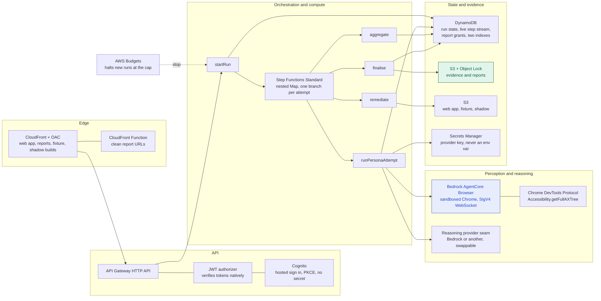
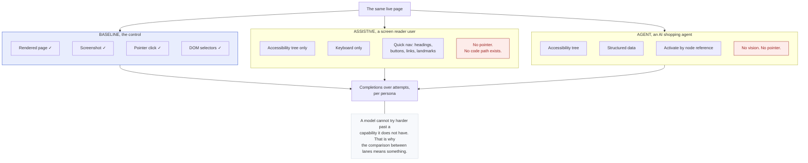
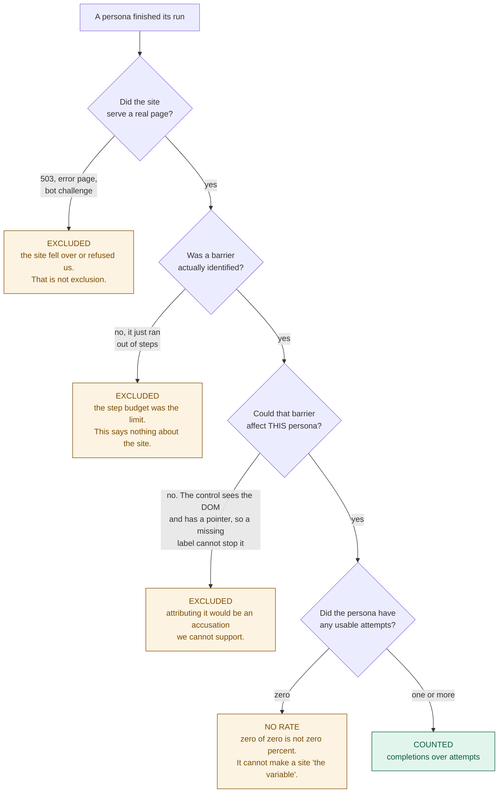
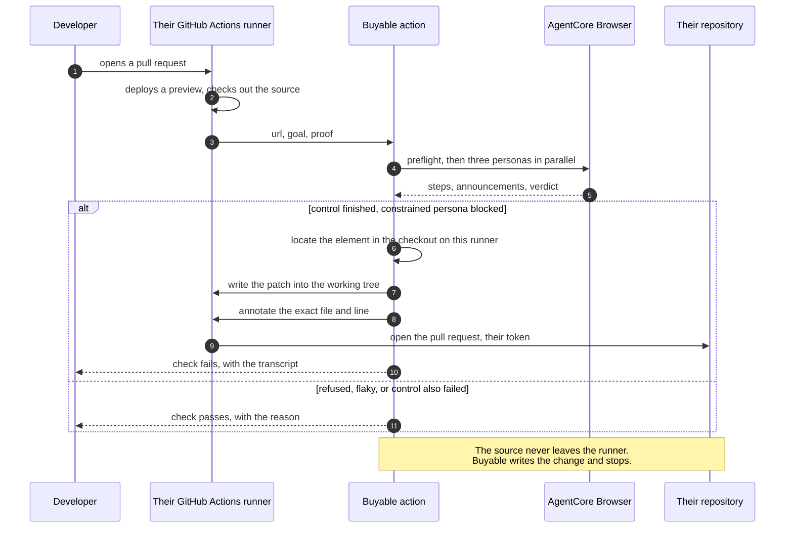

# How Buyable works, end to end

One page. If you read nothing else, read the first diagram.

## The whole thing

A URL and a sentence go in. A dated document saying whether a customer could finish
comes out, and when they could not, a patch that has been shown to change the number.

```mermaid
flowchart TB
    subgraph client ["1 . Someone asks a question"]
        U["A person, or a<br/>GitHub Action on a pull request"]
        Q["Start URL<br/>Goal in one sentence<br/>Proof that it finished"]
        U --> Q
    end

    Q --> GUARD

    subgraph gate ["2 . Refuse before spending anything"]
        GUARD["Guards<br/>robots.txt, private ranges, SSRF"]
        PRE["Preflight<br/>one page load, no model, 3 to 16s"]
        GUARD --> PRE
        PRE -->|"anti-bot page<br/>sign-in wall<br/>page 12x the step budget<br/>success text already present"| STOP["Refused, with the specific reason.<br/>Seconds, not minutes. No model spend."]
    end

    PRE -->|"worth running"| FAN

    subgraph run ["3 . Three customers, the same journey, at the same time"]
        FAN["Step Functions<br/>parallel Map"]
        B["BASELINE<br/>sees the page, uses a mouse<br/><i>the control</i>"]
        A["ASSISTIVE<br/>accessibility tree only<br/>keyboard only"]
        G["AGENT<br/>accessibility tree<br/>+ structured data"]
        FAN --> B & A & G
        B & A & G --> BROWSER["Bedrock AgentCore Browser<br/>one isolated session each<br/>driven over CDP"]
    end

    BROWSER --> LOOP

    subgraph loop ["4 . The loop, per persona, per step"]
        LOOP["Read the accessibility tree"]
        DECIDE["Model chooses one action<br/>from this persona's tool schema"]
        ACT["Act, or refuse:<br/>'this persona has no pointer'"]
        CHECK["Assert against the LIVE page.<br/>Never the model's own claim."]
        LOOP --> DECIDE --> ACT --> CHECK
        CHECK -->|"not finished"| LOOP
    end

    CHECK --> VERDICT

    subgraph verdict ["5 . What may be claimed"]
        VERDICT{"Did the control finish?"}
        VERDICT -->|"no"| INCON["Inconclusive.<br/>No control means no comparison,<br/>so nothing is blamed on the site."]
        VERDICT -->|"yes"| COMPARE{"Did a constrained<br/>persona fail?"}
        COMPARE -->|"no"| PASS["Everyone finished."]
        COMPARE -->|"yes"| BLOCK["SITE IS THE VARIABLE.<br/>Same page, same moment.<br/>Only perception changed."]
    end

    BLOCK --> FIX
    PASS --> EVID
    INCON --> EVID

    subgraph fix ["6 . Fix it, and prove the fix"]
        FIX["Locate the element in the source"]
        PATCH["Propose an anchored replacement.<br/>Must match exactly once or it is refused."]
        SHADOW["Publish a patched build<br/>to its own S3 + CloudFront"]
        RERUN["Re-run the same journey,<br/>same persona, against it"]
        FIX --> PATCH --> SHADOW --> RERUN
        RERUN --> MOVED{"Did the number move?"}
        MOVED -->|"no"| UNPROVEN["Reported as unproven.<br/>A plausible diff is a hypothesis."]
        MOVED -->|"yes"| PROVEN["Proven. 0% to 100%."]
    end

    PROVEN --> EVID
    UNPROVEN --> EVID

    subgraph out ["7 . The record"]
        EVID["S3 with Object Lock<br/>a dated record cannot be rewritten later"]
        REPORT["Report, behind a key<br/>expiring, revocable, noindex"]
        HIST["Journey history<br/>this worked on the 12th"]
        EVID --> REPORT & HIST
    end

    style STOP fill:#fdf3e2,stroke:#7a4d05,color:#7a4d05
    style BLOCK fill:#fdecea,stroke:#9a2320,color:#9a2320
    style INCON fill:#fdf3e2,stroke:#7a4d05,color:#7a4d05
    style PASS fill:#e2f5ec,stroke:#0a5c39,color:#0a5c39
    style PROVEN fill:#e2f5ec,stroke:#0a5c39,color:#0a5c39
    style UNPROVEN fill:#fdf3e2,stroke:#7a4d05,color:#7a4d05
    style CHECK fill:#e8edfd,stroke:#1d43c8,color:#1d43c8
    style B fill:#e8edfd,stroke:#1d43c8,color:#1d43c8
```

Three things in that diagram are the whole argument, and they are all in step 4 and 5:

1. **The control.** Without a persona that had every advantage and finished, a failure
   cannot be pinned on the site rather than on the model.
2. **The assertion runs against the live page.** A model that says it succeeded without
   satisfying it is recorded as a false completion, which is a more interesting outcome
   than a plain failure.
3. **A run that cannot be attributed to the site is excluded**, not counted against it.

## What it runs on

## A persona is a constraint, not a prompt

This is the part most people assume is a system prompt. It is not. Each persona is a
hard limit on what can be perceived and done, enforced in the tool layer, so the
schema the model is handed never contains the option in the first place.

## When a run is allowed to count against a site

Every branch that ends in "excluded" exists because an earlier version of this system
reported it as a site excluding disabled customers. Seven of them, in one day, against
real retailers. `packages/engine/test/attribution.test.mjs` pins each one.

## Where it runs, for a customer

The fix loop needs the site's source, and the hosted service does not have anybody's.
Running inside the customer's own CI removes the problem rather than solving it.

## The decisions behind all of this

| Decision | Where |
| --- | --- |
| Raw CDP rather than Playwright, for accessibility tree fidelity | [adr/0001](adr/0001-raw-cdp-over-agentcore-browser.md) |
| A swappable reasoning provider, and why | [adr/0002](adr/0002-reasoning-provider-seam.md) |
| Measuring completion rather than counting violations | [adr/0003](adr/0003-completion-not-violations.md) |
| Patches as anchored replacements that must match exactly once | [adr/0004](adr/0004-patches-as-anchored-replacements.md) |
| Who may read a report | [report-access.md](report-access.md) |
| Accounts, and what makes two runs the same journey | [accounts.md](accounts.md) |
| Buyable as a check on a pull request | [ci.md](ci.md) |
| What is still missing before an enterprise could adopt it | [production-readiness.md](production-readiness.md) |
