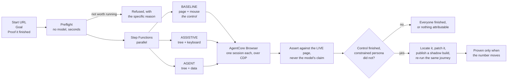

# Builder Center submission

Everything the form asks for, ready to paste. Copy the fenced blocks exactly.

**Deadline: 2 October 2026, 11:59 PM PDT.**

---

## Title

```
Buyable: proof that a customer using a screen reader, or an AI shopping agent, can actually finish buying
```

## Description

512 characters maximum. This one is 498.

```
Every accessibility tool counts the rules your site breaks. None of them tell you whether anyone can complete a purchase. Buyable attempts a real checkout three times over: as someone using a screen reader, as an AI shopping agent, and as a sighted control with a mouse. It reports whether each one finished, finds the element that stopped them, writes the patch, and re-runs the journey against a patched build to prove the fix moved the number. Built on Amazon Bedrock AgentCore Browser.
```

## Tags

Five maximum. Two are mandatory: one category, one lane.

```
#commercial-potential
#startup
#accessibility
#bedrock-agentcore
#ai-agents
```

**Why `commercial-potential` and not `social-good`:** the Social Good category is
scoped to Education, Health and Climate resilience. Accessible checkout is none of
those three, and claiming a category that does not fit is the kind of thing this
project exists to argue against. Buyable is a vertical SaaS tool sold to merchants on
a revenue and compliance argument, which is exactly what Commercial Potential
describes. The impact on disabled shoppers is real and belongs in the body, not in a
category it does not qualify for.

**Why `startup` and not `community`:** there is a product here with a path to a first
user base, priced work, and a CI distribution channel.

## Links

| Field | Value |
| --- | --- |
| GitHub repository | `https://github.com/TusharTechs/buyable` |
| Endpoint or live demo | `https://d3luufd5s1g5pn.cloudfront.net` |
| Jupyter or SageMaker notebook | leave blank |

## Cover image

`docs/submission-cover.png`, 1200 by 675, 387 KB. Under the 2 MB limit.

---

## Body

Paste with the Markdown toggle on.

````markdown
## The question nobody is answering

Every accessibility tool on the market counts violations. They will tell you your site
has 47 issues across 12 rules. None of them will tell you the thing you actually need
to know: **can a customer complete a purchase?**

Those are different questions, and the gap between them is money.

- **55 percent of online shoppers with disabilities** have abandoned a purchase because
  of accessibility barriers. In the UK alone that is 4.3 million shoppers and around
  17 billion pounds of spend walking away. (Click-Away Pound research)
- **AI shopping agents read the same accessibility tree a screen reader does.** A CHI
  2026 study from UC Berkeley and the University of Michigan measured agent task
  success falling from 78 percent to 42 percent on sites with a degraded accessibility
  tree.
- **The European Accessibility Act has been enforceable across all 27 member states
  since June 2025.** In June 2026 a French court ordered Carrefour to make its
  e-commerce site and app accessible within six months.

One missing attribute closes two revenue channels at once, and creates a legal
exposure. A tool that hands you 47 line items has not told you which one of them does
that.

## What Buyable does

It takes a real revenue journey, a checkout, a booking, an application, and attempts
it three times over:

| Persona | What it gets | What it stands for |
| --- | --- | --- |
| **Baseline** | the rendered page, a mouse, the DOM | a sighted customer. **The control.** |
| **Assistive** | the accessibility tree, the keyboard, screen reader quick navigation | a customer using a screen reader |
| **Agent** | the accessibility tree and structured data, no vision, no pointer | an AI shopping agent |

Three isolated browsers, running at the same time, on the same page. It reports
completions over attempts for each one.

When a constrained persona cannot finish and the control can, Buyable locates the
element responsible, proposes a patch, publishes a patched build, and **re-runs the
same journey against it**. A patch that applies cleanly and does not move the number
is reported as unproven.

On the fixture store, the assistive persona went from **0 of 3 to 3 of 3**. Diagnosis
through verified fix took five minutes and eight cents.

## Try it in four seconds, without an account

Paste any URL into the free inspection at
**https://d3luufd5s1g5pn.cloudfront.net**. No key, no sign-up, no model. It reads the
accessibility tree Chrome actually computed and shows you the page as a screen reader
hears it.

Here is what it found on Nike's men's shoes listing, in 83 seconds:

```
FINDINGS  99 blocking, 72 impairing
  [blocks]  A link has no text, so it is announced only as "link".  (99 elements)
            WCAG 2.4.4, 4.1.2
  [impairs] A link cannot be reached by keyboard, so it works only with a pointer.
            announced as: "Men's Shoes", link   ·   WCAG 2.1.1
```

Ninety-nine links that announce nothing. A screen reader user hears "link, link,
link". So does a shopping agent.

## Three things that make a Buyable result mean something

**1. A persona is a constraint, not a prompt.** This is the part people assume is
system-prompt theatre. It is not. Each persona is a hard limit enforced in the tool
layer: the assistive persona has no code path to a pointer click, and the schema it is
handed never contains the option. A model cannot try harder past a capability it does
not have.

**2. Completion is judged against the live page, never the model's claim.** A model
that reports success without satisfying the assertion is recorded as a
`false_completion`, which is a distinct and more interesting outcome than a plain
failure.

**3. A run that cannot be attributed to the site is excluded from the verdict, not
counted against it.** This rule cost more engineering than any feature, and it is the
reason to trust the numbers.

## The most useful thing in this submission: what went wrong

In one day, Buyable produced seven wrong results. Every one had the same shape, and
every one blamed a real retailer for a limitation of our tool.

| # | The defect | What it would have told you |
| --- | --- | --- |
| 1 | The loop detector ignored focus changes | "Your site blocks keyboard users" |
| 2 | The identical-action check fired while focus was advancing | "Your site blocks navigation" |
| 3 | Running out of step budget was attributed to a barrier | "Etsy excludes screen reader users" |
| 4 | A persona with zero usable attempts scored 0 percent | "Etsy: site is the variable" |
| 5 | The blocker locator matched only one model's phrasing | "No element identified" |
| 6 | The control persona was blamed for an accessibility barrier | "A missing label blocked a mouse user" |
| 7 | A 503 and a bot challenge were recorded as barriers | "Amazon and Target exclude disabled customers" |

Not one could have appeared against our own fixture, because the fixture is small,
static, well-behaved and ours. They were found by pointing the tool at Amazon, Etsy,
Target and Best Buy and reading the output carefully, which is the same move the
product asks its users to make.

`packages/engine/test/attribution.test.mjs` now stands where each one happened.

A clean ten out of ten would have made a more comfortable submission and a much weaker
one.

## Architecture

The full set of diagrams, including the persona constraint model and the attribution
decision tree, is in
[docs/architecture.md](https://github.com/TusharTechs/buyable/blob/main/docs/architecture.md).



**AWS services:** Bedrock AgentCore Browser (sandboxed Chrome per persona, driven over
a SigV4-signed WebSocket carrying Chrome DevTools Protocol), Step Functions, Lambda,
DynamoDB, S3 with Object Lock, CloudFront with OAC, API Gateway HTTP API, Cognito,
Secrets Manager, CloudWatch, AWS Budgets.

**Why raw CDP rather than Playwright:** `Accessibility.getFullAXTree` returns the tree
Chrome actually computed, with the ignored nodes and the computed properties intact.
Every abstraction above it loses the fidelity that this entire product depends on.
([ADR 0001](https://github.com/TusharTechs/buyable/blob/main/docs/adr/0001-raw-cdp-over-agentcore-browser.md))

## Where it ships: a check on every pull request

A web form is how you try Buyable. It is not how you use it.

```yaml
- uses: TusharTechs/buyable@main
  with:
    url: ${{ steps.deploy.outputs.preview-url }}/checkout
    goal: Add a product to the basket and reach the checkout page
    proof: Order summary
    fix: true
```

This also closes the gap that mattered most. Buyable could diagnose anybody's site and
fix only its own, because fixing needs the source and the hosted service does not have
anyone's. The expected answer was a GitHub App with repository permissions, which is a
lot of machinery and a lot of trust to ask for.

**Running inside the customer's own CI removes the problem rather than solving it.**
Their source is already checked out on the runner and their preview deployment already
has a URL. Buyable drives that URL, locates the element in the checkout on the same
machine, and writes the change into the working tree. Their workflow opens the pull
request, from their repository, with their token. The code never leaves the runner.

The check fails for exactly one thing: a persona stopped by a barrier the control got
past. A preview serving an anti-bot page, a browser session that fell over, a control
that could not finish either, each reports its reason and passes. A check that goes red
for infrastructure noise is switched off within a week, and then it protects nobody.

## How the coding agent was actually used

Claude Code, connected to AWS through the AWS MCP Server. The proof is in
[docs/coding-agent/](https://github.com/TusharTechs/buyable/tree/main/docs/coding-agent),
and it is CloudTrail's word rather than ours: `userAgent` and `sourceIPAddress` both
reading `aws-mcp.amazonaws.com`, which is a value AWS writes and no client can set.

**Where it was genuinely load-bearing:**

- Working out how to reach the AgentCore Browser automation stream. The endpoint is a
  SigV4-signed WebSocket carrying CDP, and getting the signing right took a scripted
  probe rather than a guess.
- Diagnosing a Bedrock account restriction by elimination: IAM, model agreements,
  region, inference profile and a non-Anthropic model were each ruled out before
  concluding it was account-level. That produced the provider seam, which is now the
  reason the system is not tied to one vendor.
- Two transport failures that read as unrelated bugs: Bedrock's HTTP/2 default failing
  behind a TLS-inspecting proxy, and DynamoDB refusing to marshal an undefined field.
- All seven attribution defects above were found by the agent running the tool against
  real retailers and reading the output, not by inspecting the code.

**Where it was wrong, and how that was caught:**

For most of the build the agent believed it was connected to AWS through the MCP
Server. It was not; it had been using the AWS CLI over a shell tool the whole time. The
gap was found by checking the actual configuration rather than trusting the assumption:
global config, project config, all 36 project entries and the plugin directory
contained no AWS MCP server at all.

That correction is left standing in the repository even though the connection now
works, because deleting it once it stopped being true would be exactly the tidying-up
this project argues against. The belief was confident, reasonable, and wrong, and the
only thing that settled it was going and looking.

Buyable exists because "the checkout works" is a belief of exactly that kind.

## Honest limits

- **Two of the top ten retailers refuse to serve us at all.** Buyable does not evade
  bot protection, and a vendor claiming to scan any site on the internet is either
  doing that or not telling you.
- **The fix generator is reliable on one kind of defect**, a control with no accessible
  name. Focus traps and reading order are recognised and never repaired.
- **Consent platforms inside a closed shadow root or a cross-origin iframe are
  invisible** to the accessibility tree we read, so those dialogs cannot be detected.
- **This measures completion. It does not claim conformance**, and it is not a
  substitute for an audit by people who use assistive technology every day.

The full list is in
[docs/production-readiness.md](https://github.com/TusharTechs/buyable/blob/main/docs/production-readiness.md),
a document whose first line is "No. Not yet."

## Try it

| | |
| --- | --- |
| Live app | https://d3luufd5s1g5pn.cloudfront.net |
| A real report | https://d3luufd5s1g5pn.cloudfront.net/sample-report.html |
| Source | https://github.com/TusharTechs/buyable |

Paste any URL into the free inspection. It takes four seconds and needs nothing from
you.
````

---

## Before publishing, check each of these

The qualifying requirements are pass-or-fail. Every one is verified below.

| Requirement | Status |
| --- | --- |
| Coding agent connected to AWS, with documented proof | `docs/coding-agent/`, CloudTrail records `userAgent: aws-mcp.amazonaws.com` on two dates |
| Live application on AWS, reachable by public URL | `https://d3luufd5s1g5pn.cloudfront.net`, HTTP 200 |
| Reachable by the AI scoring system | 11,310 characters of visible text in `<main>` with JavaScript disabled |
| One of five app categories | `#commercial-potential` |
| A lane | `#startup` |
| Original, not published before | First commit 2026-09-19, public repository |
| Shows the development process | The "what went wrong" section, and `docs/production-readiness.md` |
| Shows how the coding agent helped | Its own section, including where it was wrong |
| Category and lane stated in the project | In the tags and in the body |
| Link to the live app | In the body and in the Endpoint field |

## Two things only you can do

1. **Add the repository topics on GitHub.** The `gh` CLI on this machine is not
   authenticated. Either run `gh auth login` and then the command in the next section,
   or paste them into the About panel on the repository page.
2. **Publish the project before 2 October, 11:59 PM PDT.** The ship gate is
   pass-or-fail and nothing else in this document matters if the deadline passes.
